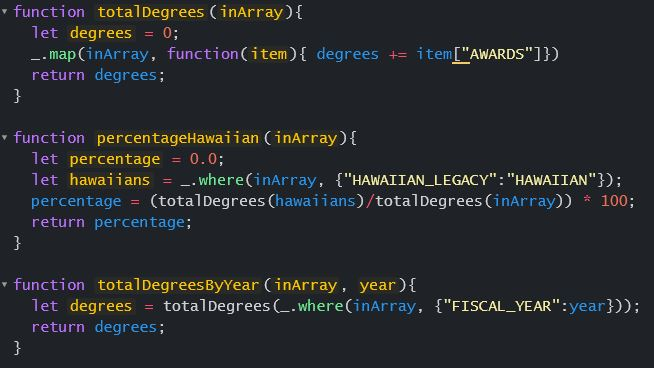

## Intelligent design

The number one idea I associate with Software Development is writing code. I think most software developers' success depends on their ability to envision a task broken down into the pieces that will be required to make it work and come up with an efficient way to create code that will accomplish the task efficiently. The solution should work efficiently but should ideally also be created efficiently, and that is where design patterns come in. Design patterns can be thought of as pre-established ways of accomplishing tasks that can be reused many times in a project, which cuts down on the time and amount of code required to make a useful program. It boils down to the fact that once we find the best way to solve a problem, we can use the experience and knowledge to avoid re-inventing the proverbial wheel and apply a verifiably good solution to future problems of a similar nature. It is safe to say that all software developers implement design patterns, though not always in a premeditated or conscious way. As I see it, any use of a method is a design pattern in a very high-level way. Writing a method is a basic way of creating a tool that can be used multiple times in a program to repeatedly accomplish a task, which is the essence of a design pattern. It is probably one of the first things a fledgling software developer will do, but the big leap is to identify when a boxed solution can be reused to accomplish a similar or more complex task by reusing  an existing tool. 

## Inventing the wheel

Here is a basic example to illustrate how methods can be used as design patterns:

This snippet of code implements the core concept of a design pattern in a few ways. First, in creating the totalDegrees function, I was able to use a pre-packaged solution offered by the Underscore library, which is itself a giant utility belt of design patterns, offering shortcuts to perform the most common tasks associated with manipulating and accessing arrays. Without the use of the map function, I would probably have elected to create some sort of loop that would increment through each item in the array to access the data and add up the AWARDS field. Instead, I am able to write a single line of code that does all that work for me. This is a huge savings in time and brainpower to accomplish a very common task. 

Creating the totalDegrees function also offered me a new tool that I could use. By indentifying the need for the new functions to do the same task as a subset of what was required to achieve the desired output, I was able to reuse totalDegrees to drastically cut down lines of code and precious minutes of typing. Imagine what these same functions would look like without design patterns. Each use of the map and where function would be a complicated loop, and each use of totalDegrees is a new instance of those loops. The same task would require easily double the amount of time and lines of code for the same task.

It is clear to see that good use of design patterns can greatly enhance a developer's ability to speed up the creation process, and as the complexity of the tasks increases, so does the payoff of reusing tools. For example, object-oriented programming benefits hugely from design patterns. Perhaps the best example is the Factory design pattern, which is the concept applied to the implementation of class constructors. The idea is that an object can be created from a constructor method, which can be used to set parameters and offer previously created methods to be called by or on that object. This obviously saves time over a more redundant approach of manually assigning properties and writing methods each time, but there's another less obvious benefit of the Factory design pattern that is very impactful. A class can be used to establish private parameters and methods, meaning that data can be assigned to an object that can be restricted from use except for specific intended ways. This is a great way to prevent accidental or even intentional misuse of a program. I have used this concept many times to create methods that are purely used within a constructor to manipulate a parameter to set multiple properties within an object and also make them read-only to an end user. 

In essence, the term "design pattern" is just a classification of existing ways developers have been writing code since before the term was coined. But it also gives us a convenient way to reference a specific implementation of a verified tool to make the software development process more efficient, and while I do truly enjoy the process of writing code, I am always a fan of anything that can speed up that process.
