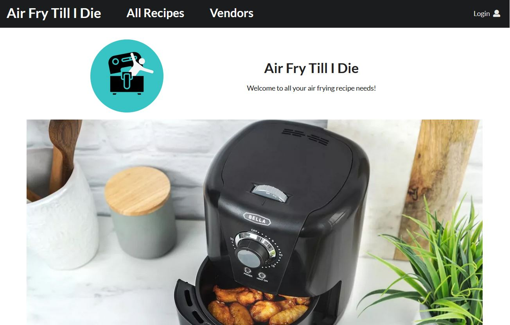
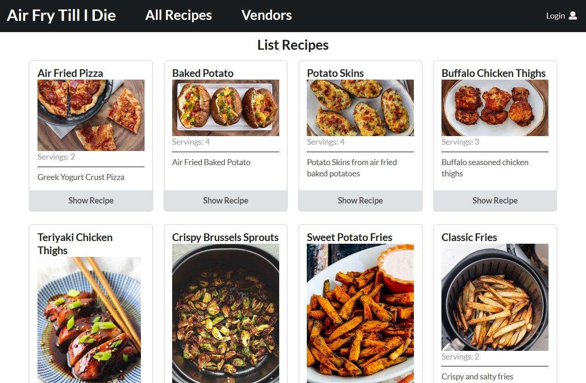

## Why Air Fry?

When I first heard of an air fryer, I instantly knew it was something I wanted. Being able to fry food without the mess and calories of frying it in oil, while maintaining the wonderful crispiness sounded too good to be true. And when I finally bought one, I was elated to find that it was not. I am a huge fan of air fryers, so I was excited to create an application that could be used by a newcomer to use one of their own to its potential.

## Vision

Originally, I wanted to make a website that focused on healthy and easy recipes for the air fryer. I specifically wanted to dig into the nutritional benefits, so I came up with some lofty goals for the end product. Beyond just recipes, I wanted to offer nutritional information for each recipe broken down by servings. To do so, I wanted to also have a list of every ingredient required across every recipe and supply the nutritional info for each ingredient. I also wanted to have an inventory, where a user could keep track of ingredients they owned. Being able to pull up a full list of what is in the pantry or fridge at home would be so useful to make sure important ingredients are not forgotten, and help a user avoid buying duplicates of spices or other long-life ingredients that they might not use every day. Lastly, I wanted to provide a list of vendors for these ingredients along with prices to be able to calculate a cost per serving in addition to the nutrition.

## Process

To make these things happen, the first thing that was required was tons of research. I scoured the internet for beginner-friendly recipes, coming up with a list of approximately 40, sourced from various pioneers of air fryer cuisine. Then, I compiled a list of all the ingredients used, which came out to well over 100 ingredients. Lastly, I broke down each ingredient to the smallest unit used in a recipe to establish a serving size, then calculated the nutritional information for that quanitity of each ingredient.

After the research, I began developing the application with a team of talented software engineers. We used a template that provided numerous tools that cut down our work, like a system for creating and logging into user accounts. The first task we tackled was to create a page for viewing recipes. We opted to use clickable cards for each recipe, allowing all the recipes to be listed neatly and identified visually, and to allow a user to view details of a recipe without navigating to a different page.

Next, we did the same for ingredients. While it wasn't necessarily important to view a list of all ingredients used in the recipes, this provided a foundation for the inventory system, where a user might want to be able to see at a glance what all they already have.

After these components were done, we created a page to add user recipes. While this no longer exists in the current version, I hope to be able to implement it again with enhanced functionality in the future. The challenge was figuring out how to add ingredients to a recipe, specify a quantity, and be able to do so as many times as needed for all the ingredients required by any recipe. We ultimately decided to remove this feature to avoid abuse by pranksters, who might create obscene recipes for public access.

Of course, we also had to create the default data sets with all the recipe and ingredient information. This was probably the most time-consuming task, as every recipe required a list of ingredients and associated quantities, as well as instructions. Each ingredient also required detailed nutritional information. Both recipes and ingredients also had images for the clickable cards, which took time to find.

In the end, we had to cut some of the features we originally wanted to implement. However, we did produce the list of recipes, ingredients, inventory, and vendors. 

## Future

This project was a great learning experience. In addition to learning new tools for the coding itself, I also learned some great lessons about project management and development. This was my first experience managing a project where I set all the goals myself, rather than figuring out how to accomplish a pre-defined list of tasks. The biggest lesson is to promise little and deliver more. I am proud of the application, but implementing aspects and then having to remove them in the end did not feel great, and would not be enjoyable for an end user. 

I plan to keep working on this project to fully bring what my vision to life. I still need to get the recipes to link up with ingredients for nutrition, and I need to link ingredients with vendors for pricing. I also need to create an admin interface to edit or remove recipes. I also think new recipes should require admin approval before showing up on the public recipe list. 

Another feature I would love to be able to implement is for a user to select recipes, and for the application to analyze the user's inventory to automatically produce a shopping list and suggest a vendor that would offer the best value for the ingredients.
