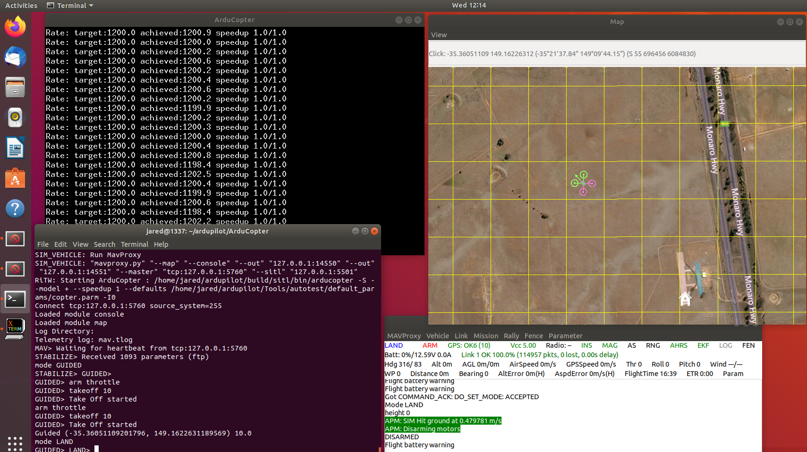
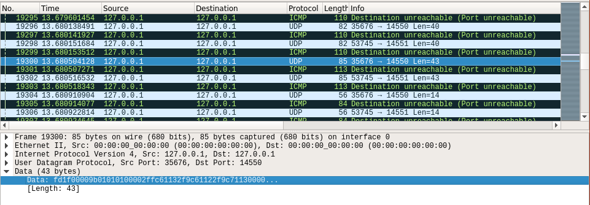

## Drone Applications 

I believe drones offer many innovations in commercial, military, and scientific applications. While some companies and organizations already use them, I believe they will become more common in the near future, which will also result in a larger job market for engineers who are knowledgeable in the creation and securing of drone applications. During the summer of 2020, I had the opportunity to work on a research project studying drone application developement. I specifically focused on the communication between a drone and a ground control station. For my research, I used a linux virtual machine to retrieve the git repository for ArduPilot, which is a project that started in 2007 with the creation of a drone built from Lego Mindstorms pieces as the hardware, and used an Arduino board as the flight controller, hence the name ArduPilot. Since then the project has grown and has a small army of contributors. The ArduPilot repository now contains code to handle multiple types of vehicles beyond just drones, including submarines and land rovers.

One of the very useful parts of the ArduPilot project is an application called Software-in-the-Loop, or SITL. SITL is a simulated drone that acts exactly as a real drone does, but does not require any monetary investment for hardware, and also does not come with the risk of losing or damaging a drone during application testing, nor does it run the risk of landing an aspiring engineer in hot water for violating airspace regulations. SITL can be controlled via Python scripts through another project called DroneKit, which I used in my research, but can also be controlled with the same ground control software that is used to control physical drones. It also allows for manual control through a built-in GUI

## Drone Communications

One of the major challenges in developing drone applications is communication with the ground control station. In my research, I was able to see the TCP & UDP packets that were exchanged between the drone and ground control, which in a real-world setting would rely on WiFi communications and telemetry modules, which are susceptible to failure. Dropping communication can result in an array of undesirable outcomes like crashes or flyaways. These can also be caused by intentional malicious interference. I focused on the latter part of that issue in my research by capturing packets and analyzing the contents with Scapy and Wireshark, then attempting to create and inject commands that could throw off the intended flight path and behavior. ArduPilot uses a protocol called MAVLink, which encodes messages in specific packet structures that can be found online. The latest version of MAVLink introduced some security controls to the packet structure that did not exist in the first iteration, which makes it very difficult to interfere with the proper communications. I was not able to do so in the short time I was working on this project, but I know it can definitely be done with enough time and knowledge of how it works. I still tinker with this project from time to time to see if I can crack the security and inject commands.

 

*An example packet. 'fd' indicates the start of a MAVLink-generated message.*
