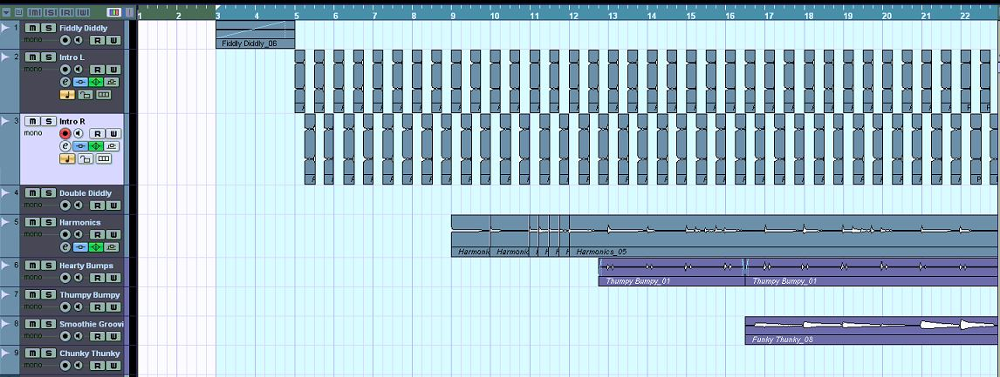

When quarantine started in March 2020, I found that working and attending classes from home left me with much more free time. One of the benefits of this is that it allowed me to spend more time practicing and recording music. The first project I started and completed in this period is a bass cover of the Lavender Town theme from Pokemon R/G/Y. My initial goal was just to create a piece of music that was played entirely on bass, but in the end I decided to make one small exception and sample the iconic dissonant high-pitch tones from the original piece. However, the rest is all played on a bass guitar, using a combination of harmonics, percussive slapping, and traditional playing.

The samples I used were split up and panned right and left in an alternating pattern, which I felt contributed to a spooky ethereal vibe. I added the melody played as harmonics, and added a layer played normally but in the upper register of the bass. In place of a drum recording or sampled drum track, I opted to slap the strings while muted to create a thumpy sound that I intended to have sound like a heartbeat. In the latter half of the track, I played a more complex beat by slapping and popping the strings, in a similar way to how funky slap basslines are done, but with the strings muted so there were no notes, only percussive sounds. In addition to this I added a normal bassline to round out the lower spectrum, which is simple at first but builds to a more complicated line in time with the 'drums'.

 Lastly, I asked my wife to create a cover image I could use when posting my composition. She did a water color painting, also inspired by the same video game. I used the image to create a video, which is more easily shared on social media than just an audio recording. Since the music is taken from a section in the game that revolves around a town that serves as a cemetary, the artwork is inspired by ghosts in a cemetary setting. One of the gravestones carries my wife's pseudonym she uses to post her art, and the other reads beloved friend. After I finished my work and decided I wanted to post it, she suggested I also do so under a specific and memorable name in case I wish to continue creating new projects and sharing them. I decided to use "beloved friend" as that name, inspired by the artwork.

If you would like to listen to the song and see the accompanying artwork, you can check out the [YouTube video](https://www.youtube.com/watch?v=uwhetHwG7iE&t).

